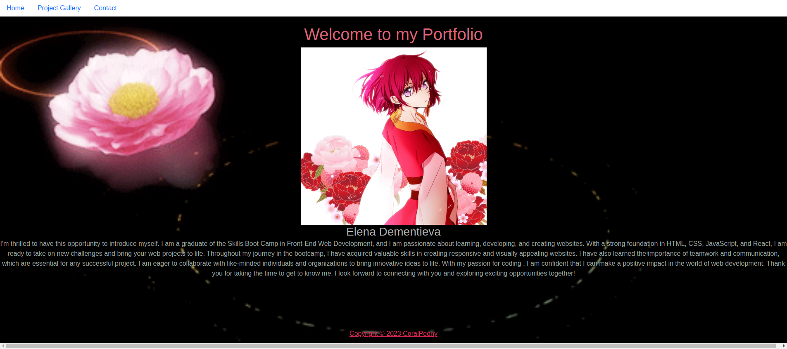

# React_Portfolio_EDementieva

  

## Description

The task in this Challenge is to develop the initial scaffolding of my portfolio site from scratch using React.
In this challenge I applied the core skills we've learned, such as JavaScript, Node.js and React.

This portfolio highlights six projects I have completed.

## Installation

N/A

## Usage of the application:

The website is built using React and React Router. To review the code, open the Chrome DevTools by pressing Command+Option+I (macOS) or Control+Shift+I (Windows). A console panel should open either below or to the side of the webpage in the browser.

## Credits

N/A

## License

MIT License